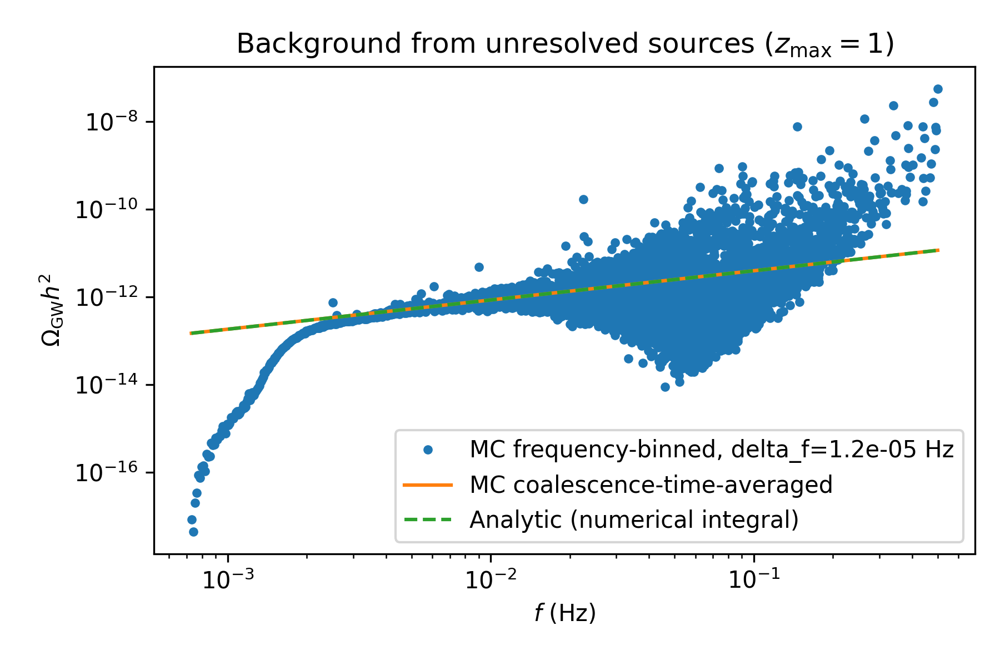
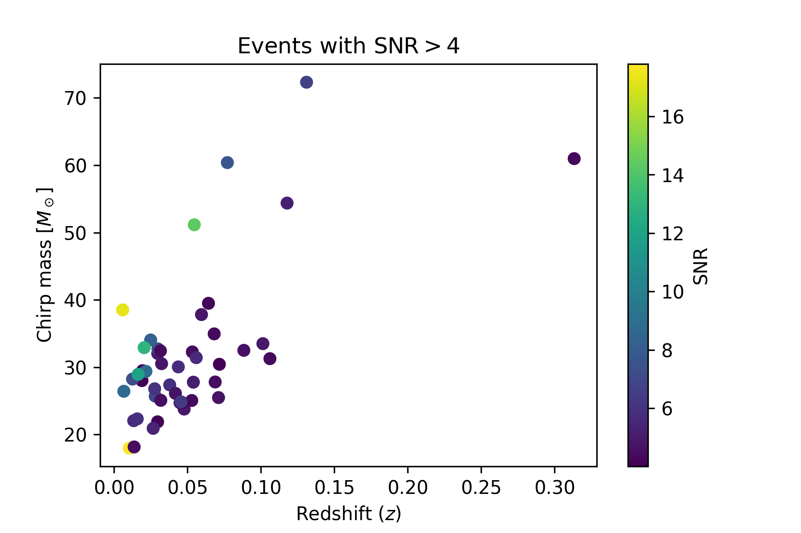

`extrapops`: fast simulation and analysis of extra-galactic binary GW sources
=============================================================================

:Author: `Jesus Torrado`_, based on work in collaboration with Stanislav Babak, Chiara Caprini, Daniel Figueroa, Nikolaos Karnesis, Paolo Marcoccia, Germano Nardini, Mauro Pieroni, Angelo Ricciardone and Alberto Sesana

:Source: `Source code at Github <https://github.com/jesustorrado/extrapops>`_

:Documentation: See tutorial `here <https://github.com/JesusTorrado/extrapops/blob/main/examples/Tutorial.ipynb>`_

:Licence: `LGPL-3.0 <https://www.gnu.org/licenses/lgpl-3.0.en.html>`_

:Installation: ``pip install -e .`` from root folder of the project.

This package contains tools for simulating extra-galactic populations of gravitational waves sources (at the moment BBH only) and model their emission during the inspiral phase. It can approximately assess the detectability of individual sources by LISA, and compute the background due to unresolved sources in the LISA band using different methods. The simulated populations can be saved in a format compatible with LISA LDC.

The current BBH models are based on `arXiv:2111.03634 <https://arxiv.org/abs/2111.03634>`_ and references therein.

Simulations are well calibrated to produce accurate background calculations and fair random generation at the tails of the distributions (important for accurate probability of detectable events). This code uses a number of ad-hoc techniques for rapid simulation (O(1min) for large LISA-relevant populations). There is a lot of room for further optimisation, up to almost 1 order of magnitude, if required (please, get in touch).

.. _`Jesus Torrado`: https://jesustorrado.github.io
